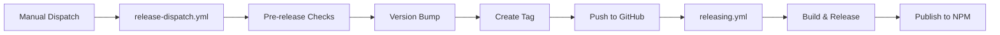

# GitHub Actions Workflows

This directory contains the GitHub Actions workflows for the `kubeasy-cli` project.

## Workflows

### 🚀 [release-dispatch.yml](./release-dispatch.yml) - Manual Release

**Trigger:** Manual workflow dispatch

**Purpose:** Manually trigger a new release with a specific version bump (patch, minor, or major).

**Usage:**
1. Go to [Actions → Manual Release](https://github.com/kubeasy-dev/kubeasy-cli/actions/workflows/release-dispatch.yml)
2. Click "Run workflow"
3. Select version bump type (patch/minor/major)
4. Click "Run workflow"

**What it does:**
- Runs all pre-release validation checks:
  - Verify on main branch
  - Check working directory is clean
  - Run tests with race detector
  - Run golangci-lint
  - Test build
- Calculates new version based on selection
- Updates `package.json` and `package-lock.json`
- Creates commit and tag
- Pushes to GitHub (triggers the release workflow)

---

### 📦 [releasing.yml](./releasing.yml) - Automated Release

**Trigger:** Push of version tags (v*.*.*)

**Purpose:** Build binaries, create GitHub release, and publish to NPM.

**What it does:**
- Pre-release validation (tests, linters, build)
- Build binaries for all platforms using GoReleaser
- Upload binaries to Cloudflare R2
- Create GitHub release with artifacts
- Publish to NPM

---

### 🧪 [lint.yml](./lint.yml) - Code Quality

**Trigger:** Pull requests and pushes

**Purpose:** Run linters on code changes.

---

### 🤖 [claude-code-review.yml](./claude-code-review.yml) - AI Code Review

**Trigger:** Pull requests

**Purpose:** AI-powered code review using Claude.

---

## Release Process Flow



## Environment Variables & Secrets

### Secrets Required

- `GITHUB_TOKEN` - Automatically provided by GitHub Actions
- `R2_ACCESS_KEY_ID` - Cloudflare R2 access key for binary storage
- `R2_SECRET_ACCESS_KEY` - Cloudflare R2 secret key for binary storage
- `NPM_TOKEN` - NPM authentication token for publishing

### Permissions

Workflows use minimal permissions by default and request specific permissions per job:
- `contents: read` - Read repository contents
- `contents: write` - Create releases and push tags
- `id-token: write` - OIDC token for authentication

## Testing Workflows Locally

### Test Commands Individually

```bash
# Run tests
go test -v -race -coverprofile=coverage.out ./...

# Run linters
golangci-lint run --config .github/linters/.golangci.yml

# Test build
go build -o /tmp/kubeasy .
```

### Test Release Build

```bash
make release-local
```

### Test with act (GitHub Actions locally)

```bash
# Install act
brew install act

# Run release-dispatch workflow
act workflow_dispatch -W .github/workflows/release-dispatch.yml
```

## Workflow Security

- ✅ Actions are pinned to specific SHA hashes
- ✅ Minimal permissions per job
- ✅ No secrets in logs
- ✅ OIDC authentication where possible
- ✅ Dependabot keeps actions up to date

## Troubleshooting

### Workflow fails on "Pre-release checks"

Run the checks locally to identify the issue:
```bash
# Run tests
go test -v ./...

# Run linters
golangci-lint run --config .github/linters/.golangci.yml

# Test build
go build .
```

### Workflow fails on "Push changes"

Ensure you have write permissions to the repository and the `main` branch is not protected in a way that blocks bot commits.

### NPM publish fails

1. Verify `NPM_TOKEN` secret is set and valid
2. Check if the version already exists on NPM
3. Verify package name is available

### Release workflow doesn't trigger

1. Ensure tag follows `v*.*.*` format
2. Check if workflow file is on `main` branch
3. Verify GitHub Actions are enabled for the repository

## Related Documentation

- [RELEASE.md](../../docs/RELEASE.md) - Complete release process documentation
- [Makefile](../../Makefile) - Build and test commands
- [release.sh](../../scripts/release.sh) - Local release script
